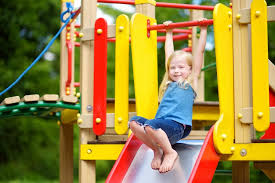

# ECE1508GroupProject

This project implements an image captioning system using a Vision Transformer (ViT) and GPT-2 model. The system is trained on the Flickr8k dataset and can generate captions for images.

---

## Project Structure

- **`dataset/`**  
  Contains the Flickr8k dataset and a `test/` folder with sample test image.

- **`model/`**  
  Stores the trained ViT-GPT2 model.

- **`scripts/`**  
  Contains the following scripts:

  - `download_flickr8k.py`: Downloads and extracts the Flickr8k dataset.
  - `train_ViT_GPT2.py`: Trains the ViT-GPT2 model on the Flickr8k dataset.
  - `caption_generator.py`: Generates captions for a given image using the trained model. This script can also be used as a demo.

- **`requirements.txt`**  
  Lists the Python dependencies required for the project.

---

## Setup

### 1. Create and Activate a Virtual Environment

Run the following commands to set up a virtual environment and install the required dependencies:

```bash
python -m venv venv
source venv/bin/activate  # On Windows: venv\Scripts\activate
pip install -r requirements.txt
```

### 2. Download the Dataset

Run the script to download and extract the Flickr8k dataset:

```bash
python scripts/download_flickr8k.py
```

### 3. Train the Model

Train the ViT-GPT2 model using the following command:

```bash
python scripts/train_ViT_GPT2.py
```

---

## Demo: Generate Captions for an Image

You can use the `caption_generator.py` script as a demo to generate captions for an image. Follow these steps:

1. Run the following command, providing the path to your image:

   ```bash
   python scripts/caption_generator.py --image_path <path_to_image>
   ```

   Replace `<path_to_image>` with the path to your image. For example:

   ```bash
   python scripts/caption_generator.py --image_path dataset/test/test_image.jpg
   ```

2. The script will load the trained model and generate a caption for the provided image.

### Example Input Image and Generated Caption

Here is an example of the input image and the generated caption:



**Generated Caption**: "a little boy is playing soccer in a field ."

---

## Dataset

The project uses the Flickr8k dataset, which contains 8,092 images, each paired with 5 captions. The dataset is downloaded and extracted into the `dataset/Flickr8k/` folder.

---

## Model

The image captioning model combines a Vision Transformer (ViT) for image feature extraction and GPT-2 for text generation. The trained model is saved in the `model/` folder.
